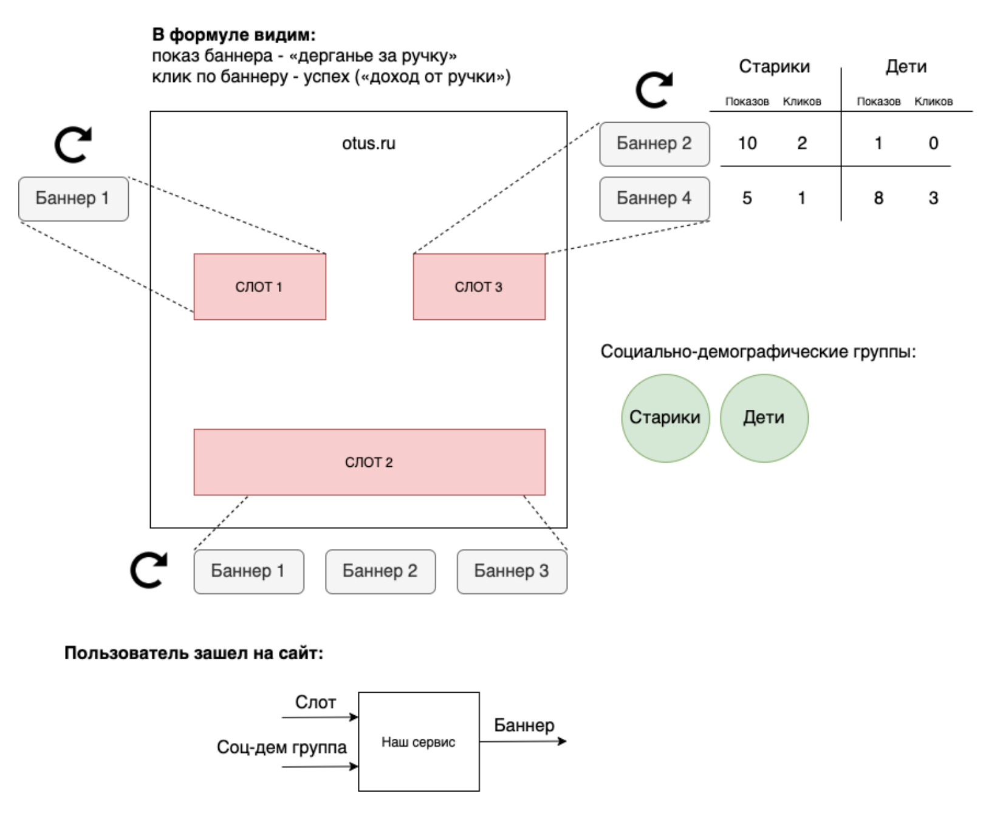

# ТЗ на сервис "Ротация баннеров"

## Общее описание
Сервис "Ротация баннеров" предназначен для выбора наиболее эффективных (кликабельных) баннеров,
в условиях меняющихся предпочтений пользователей и набора баннеров.

Предположим, что на сайте есть место для показа баннеров (слот) и есть набор баннеров, которые 
конкурируют за право показа в этом месте. Набор баннеров постоянно обновляется - добавляются новые,
старые удаляются. Так же у пользователя меняются предпочтения - если им показывать все время один
и тот же баннер, пользователь перестает его замечать. Задача сервиса - осуществлять "ротацию" баннеров, 
показывая те, которые наиболее вероятно приведут к переходу.

Для этого предполагается использовать алгоритм "Многорукий бандит":
https://habr.com/ru/company/surfingbird/blog/168611/

Кроме того пользователи неоднородны - их можно условно разделить на социально-демографические группы. 
В разных группах пользователей могут быть разные предпочтения.

## Архитектура
Сервис состоит из API и базы данных в которой хранится информация о баннерах.
Сервис должен предоставлять GRPC **или** REST API.

## Описание сущностей
### Слот
Слот - место на сайте, на котором мы показываем баннер.
* ID
* Описание

### Баннер
Баннер - рекламный/информационный элемент, который показывается в слоте.
* ID
* Описание

Один баннер может участвовать в ротации в нескольких слотах.

Статистика по баннеру ведется в рамках одного слота.

### Соц-дем. группа пользователей
Соц-дем. группа - это группа пользователей сайта со схожими интересами,
например "девушки 20-25" или "дедушки 80+".
* ID
* Описание

## Описание методов

### Добавить баннер
Добавляет новый баннер в ротацию в данном слоте.
* ID баннера
* ID слота

### Удалить баннер
Удаляет баннер из ротации в данном слоте.
* ID слота
* ID баннера

### Засчитать переход
Увеличивает счетчик переходов на 1 для указанного баннера в данном слоте в указанной группе.
* ID слота
* ID баннера
* ID соц-дем. группы

### Выбрать баннер для показа
Основной метод. Возвращает баннер который следует показать в данный момент в указанном
слоте для указанной соц-дем. группы. Увеличивает число показов баннера в группе.

Принимает:
* ID слота
* ID соц-дем. группы

Возвращает:
* ID баннера

## Выгрузка статистики
Микросервис должен отправлять события кликов и показов в очередь (например kafka)
для дальнейшей обработки в аналитических системах.

Формат событий следующий:
* Тип: клик или показ
* ID слота
* ID баннера
* ID соц.дем группы
* Дата и время
  
## Развертывание
Развертывание микросервиса должно осуществляться командой `make run` (внутри `docker compose up`)
в директории с проектом.

## Тестирование
Алгоритм "многорукого бандита" рекомендуется выделить в отдельный модуль и покрыть unit-тестами.

Также необходимо написать интеграционные тесты проверяющие работу сервиса через его API.

При тестировании необходимо проверить сценарии:
* Перебор всех: после большого количества показов, каждый баннер должен быть показан хотя один раз.
* Выбор популярных: если на один из баннеров кликают, у него должно быть существенно больше показов чем у остальных.

## Разбалловка
Максимум - **15 баллов**
(при условии выполнения [обязательных требований](./README.md)):

* Реализован алгоритм "многорукого бандита" - 2 балла.
* Реализовано разделение на "слоты" и "соц.дем. группы" - 2 балла.
* Реализовано API сервиса - 2 балла.
* Реализована отправка статистики в очередь - 1 балл.
* Написаны юнит-тесты - 1 балл.
* Написаны интеграционные тесты - 2 балла.
* Тесты адекватны и полностью покрывают фукнционал - 1 балл.
* Проект возможно собрать чере `make build`, запустить через `make run`
  и протестировать через `make test` - 1 балл.
* Понятность и чистота кода - до 3 баллов.

#### Зачёт от 10 баллов
